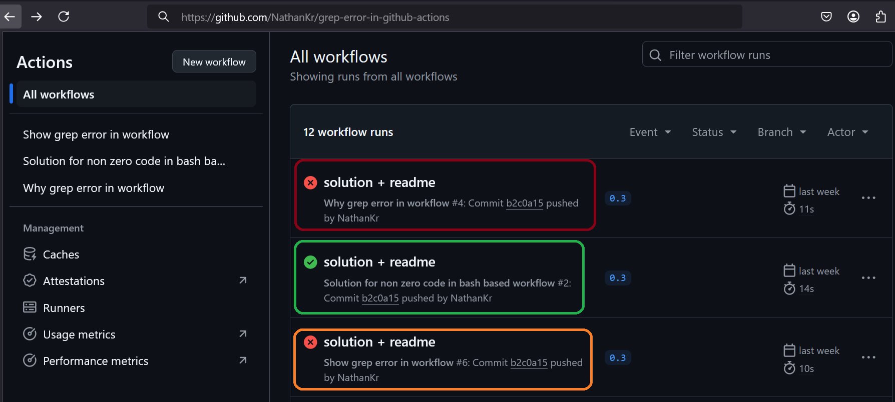

<h1>Project Name</h1>
Handle non zero exit code in github actions bash


<h2>Project Description</h2>
The project has three workflows with self descriptive names

<ol>
<li>show-problem.yml</li>
<li>why-problem.yml</li>
<li>solution.yml</li>
</ol>

<h2>Motivation</h2>
You are using grep in your github actions workflow. You are looking for something using grep. sometime you find it and some time you dont , when you dont you get error and the workflow stops  - how to handle this ?

Altough i use here grep this repo is not just for grep but for any bash command with non zero code that is not an error


<h2>Installation</h2>
Non required unless you want to use act - check <a href='#ref2'>[2]</a>


<h2>Usage</h2>
via push to github or act


<h2>Technologies Used</h2>
<ul>
<li>github actions</li>
<li>act</li>
<li>bash</li>
</ul>

<h2>Design</h2>
Bottom line is to suround bash command that is success but might return non zero code with set +e \ set -e

```bash
set +e
.... 
set -e
```


<h2>Demo and Code</h2>

In the following image you can see the run of the three workflows :
<ul>
<li>in green solution.yml</li>
<li>in brown why-problem.yml</li>
<li>in orange show-problem.yml</li>
</ul>


<h3>Show problem</h3>

given show-problem.yml

```yml
    steps:
    - name: create file
      run: echo 'a1 , a2 , a3' > a.txt

    - name: simple grep found
      run: |
        grep a1 a.txt
        echo 'after grep found'

    - name: simple grep not found
      run: | 
        grep a4 a.txt  
        echo 'after grep not found'
```

invoke
```bash
act -j show-problem
```

And you will see in the following image that `echo 'after grep not found' is not shown because grep not found issue and error


<h3>Why problem</h3>

given why-problem.yml

```yml
    steps:
        - name: create file
          run: echo 'a1 , a2 , a3' > a.txt
    
        - name: simple grep found
          run: |
            grep a1 a.txt
            echo "grep found exit code: $?"
            echo 'after grep found'
    
        - name: simple grep not found
          run: | 
            grep a4 a.txt  
            echo "grep not found exit code: $?"
            echo 'after grep not found'    
```

invoke

```bash
act -j why-problem
```

And you will see in the following image that when grep is success its return code is 0 and when it fail i.e. nothing is found it return 1. BTW, If grep fail it will return 2


The issue is that github actions regard non zero code as fail in bash , check <a href='https://docs.github.com/en/actions/writing-workflows/workflow-syntax-for-github-actions?form=MG0AV3#exit-codes-and-error-action-preference'>here</a>


<h3>Solution</h3>

given solution.yml

```yml
    steps:
      - name: create file
        run: echo 'a1 , a2 , a3' > a.txt

      - name: run grep and check result - pattern not found
        run: |
          set +e # disables the behavior, allowing the script to continue executing even if a command returns a non-zero exit code
          grep a4 a.txt
          EXIT_CODE=$?
          set -e  # enables the behavior where any command that returns a non-zero exit code will cause the script to exit immediately. 
          echo "Exit code: $EXIT_CODE"
          if [ $EXIT_CODE -eq 0 ]; then
            echo "Pattern found"
          else
            echo "Pattern not found"
          fi
```


invoke

```bash
act -j solution-non-zero-code
```

And you will see in the following image that the workflow continue when grep find the pattern (code 0) and also when grep do not find the pattern (code 1)


<h2>References</h2>
<ol>
    <li id='ref1'><a href='https://www.youtube.com/watch?v=x239z6DdE0A'>Introduction to GitHub Actions: Learn Workflows with Examples </a></li>
    <li id='ref2'><a href='https://www.youtube.com/watch?v=Mir-olSQmwA'>Efficiently Run GitHub Actions Workflows Locally with act Tool </a></li>
    <li id='ref3'><a href='https://www.youtube.com/watch?v=sEBGmPZh75U'>Simplified CI/CD Workflow with GitHub Actions </a></li>
</ol>

