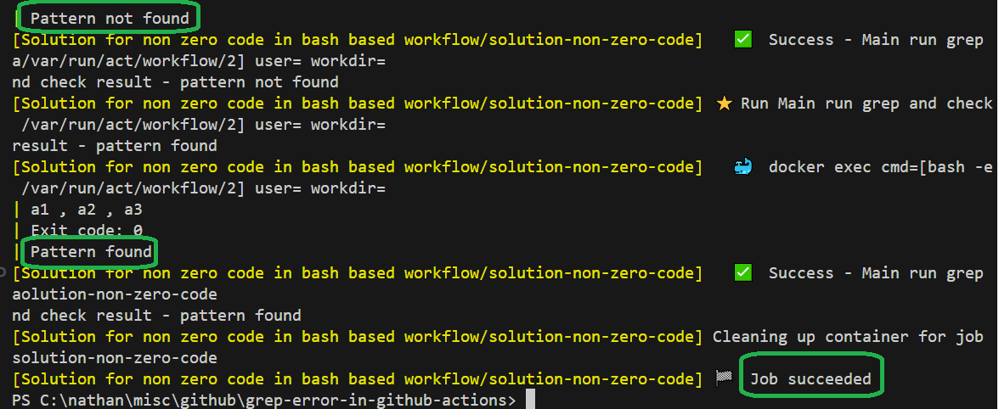

<h1>Project Name</h1>
Grep Non-Zero Exit Code in Github Actions


<h2>Project Description</h2>
<p>This project includes three workflows, each designed to address a specific aspect of handling non-zero exit codes in GitHub Actions:</p>
<ol>
    <li>
        <b>show-problem.yml:</b>
        <p>Demonstrates the issue caused by non-zero exit codes in bash commands during a workflow.</p>
    </li>
    <li>
        <b>why-problem.yml:</b>
        <p>Explains the root cause of the issue by examining the exit codes returned by bash commands.</p>
    </li>
    <li>
        <b>solution.yml:</b>
        <p>Presents a way to handle non-zero exit codes gracefully, ensuring the workflow continues successfully.</p>
    </li>
</ol>

<h2>Motivation</h2>
<p>
    You are using <code>grep</code> in your GitHub Actions workflow to search for something. 
    Sometimes it is found, and sometimes it isn't. When it isn't found, 
    the workflow encounters an error and stops. This raises the question: how can you handle this scenario effectively?
</p>
<p>
    Although this repository focuses on <code>grep</code>, the solution is not limited to it. 
    It applies to any bash command that may return a non-zero exit code that is not necessarily an error.
</p>

<h2>Installation</h2>
<p>
    No installation is required unless you want to use <code>act</code>. 
    For more details, check <a href="#ref2">[2]</a>.
</p>

<h2>Usage</h2>
<p>
    This project demonstrates how to handle non-zero exit codes in GitHub Actions workflows. 
    These workflows can be triggered by <b>push events</b> or tested locally using the <code>act</code> tool.
</p>


<h2>Technologies Used</h2>
<ul>
    <li><code>GitHub Actions</code>: Automate workflows and manage CI/CD processes.</li>
    <li><code>act</code>: Test GitHub Actions workflows locally.</li>
    <li><code>Bash</code>: Execute shell commands and scripts in the workflows.</li>
</ul>

<!-- 
<h2>Design</h2>
The key takeaway is to surround bash commands that are successful but might return a non-zero exit code with <code>set +e</code> and <code>set -e</code>.

```bash
set +e
.... 
set -e
``` -->

<h2>Design</h2>
<p>
    The key takeaway is to surround bash commands that are successful but might return a non-zero exit code with 
    <code>set +e</code> and <code>set -e</code>.
</p>

```bash
set +e
....
set -e
```

<p>
    Here's what these commands do:
</p>
<ul>
    <li>
        <b><code>set +e</code>:</b> Disables the default behavior in bash where a non-zero exit code 
        from a command causes the script to terminate immediately. This allows the script to continue execution 
        even if a command fails or returns a non-zero exit code.
    </li>
    <li>
        <b><code>set -e</code>:</b> Re-enables the default behavior where the script exits immediately 
        if any command returns a non-zero exit code. Use this after handling the specific command that might 
        fail but shouldn't terminate the entire workflow.
    </li>
</ul>

<p>
    By using <code>set +e</code> and <code>set -e</code>, you can handle non-zero exit codes gracefully 
    without interrupting the workflow.
</p>


<h2>Demo and Code</h2>
<p>
    The following image shows the execution of the three workflows:
</p>
<ul>
    <li><b>In green:</b> <code>solution.yml</code></li>
    <li><b>In brown:</b> <code>why-problem.yml</code></li>
    <li><b>In orange:</b> <code>show-problem.yml</code></li>
</ul>


<h3>Show Problem</h3>
<p>
    The following workflow <code>show-problem.yml</code> demonstrates an issue where a <code>grep</code> command 
    fails to find a pattern, causing the workflow to stop prematurely.
</p>

```yml
steps:
- name: create file
  run: echo 'a1 , a2 , a3' > a.txt

- name: simple grep found
  run: |
    grep a1 a.txt
    echo 'after grep found'

- name: simple grep not found
  run: | 
    grep a4 a.txt  
    echo 'after grep not found'
```
<p>
    To invoke this workflow, use the following command:
</p>

```bash
act -j show-problem
```

<p>
    In the image below, you can see that the <code>echo 'after grep not found'</code> statement is 
    not executed because the <code>grep</code> command failed and resulted in an error.
</p>


<h3>Why Problem</h3>
<p>
    The following workflow, <code>why-problem.yml</code>, illustrates why non-zero exit codes from bash commands 
    like <code>grep</code> cause issues in GitHub Actions.
</p>

```yml
steps:
    - name: create file
      run: echo 'a1 , a2 , a3' > a.txt
  
    - name: simple grep found
      run: |
        grep a1 a.txt
        echo "grep found exit code: $?"
        echo 'after grep found'

    - name: simple grep not found
      run: | 
        grep a4 a.txt  
        echo "grep not found exit code: $?"
        echo 'after grep not found'
```

<p>
    To invoke this workflow, run the following command:
</p>

```bash
act -j why-problem
```

<p>
    In the image below, you can observe that when <code>grep</code> succeeds, it returns an exit code of <b>0</b>.
    When it fails to find a match, it returns an exit code of <b>1</b>. If <code>grep</code> encounters an error, 
    it will return an exit code of <b>2</b>.
</p>


<p>
    The issue arises because GitHub Actions treats non-zero exit codes from bash commands as workflow failures. 
    For more details, refer to the GitHub Actions documentation 
    <a href="https://docs.github.com/en/actions/writing-workflows/workflow-syntax-for-github-actions?form=MG0AV3#exit-codes-and-error-action-preference">here</a>.
</p>


<h3>Solution</h3>
<p>
    The following workflow <code>solution.yml</code> demonstrates how to gracefully handle non-zero exit codes 
    from bash commands, such as <code>grep</code>, in GitHub Actions. This ensures the workflow continues 
    even when the command fails to find a pattern.
</p>

```yml
steps:
  - name: create file
    run: echo 'a1 , a2 , a3' > a.txt

  - name: run grep and check result - pattern not found
    run: |
      set +e # disables the behavior, allowing the script to continue executing even if a command returns a non-zero exit code
      grep a4 a.txt
      EXIT_CODE=$?
      set -e  # enables the behavior where any command that returns a non-zero exit code will cause the script to exit immediately. 
      echo "Exit code: $EXIT_CODE"
      if [ $EXIT_CODE -eq 0 ]; then
        echo "Pattern found"
      else
        echo "Pattern not found"
      fi
```

<p>
    To invoke this workflow, use the following command:
</p>

```bash
act -j solution-non-zero-code
```

<p>
    The image below demonstrates that the workflow continues execution, regardless of whether 
    <code>grep</code> finds the pattern (exit code 0) or does not find the pattern (exit code 1).
</p>




<h2>References</h2>
<ol>
    <li id="ref1">
        <a href="https://youtu.be/x239z6DdE0A?si=NTRMaF2Ks0XaNPmX" target="_blank">
            Introduction to GitHub Actions: Learn Workflows with Examples
        </a>
    </li>
    <li id="ref2">
        <a href="https://youtu.be/Mir-uLSQmwA?si=L5ifG_pulM3Aq9RY" target="_blank">
            Efficiently Run GitHub Actions Workflows Locally with act Tool
        </a>
    </li>
    <li id="ref3">
        <a href="https://youtu.be/sEBGmPZh75U?si=xu7VVvGSfUYjuxcd" target="_blank">
            Simplified CI/CD Workflow with GitHub Actions
        </a>
    </li>
</ol>

