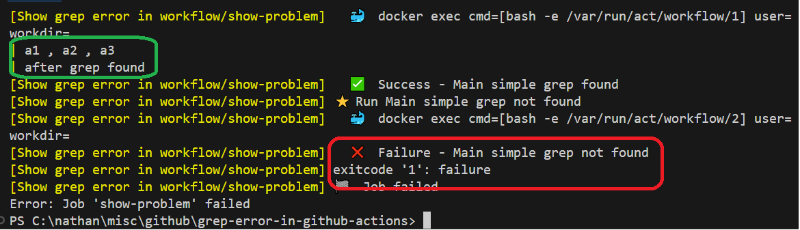
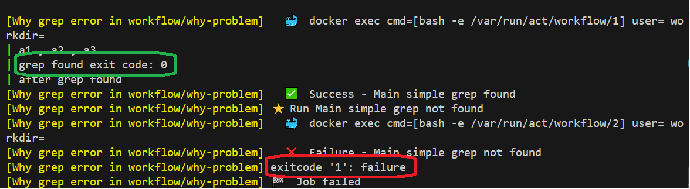

<h1>Project Name</h1>
grep error in github actions


<h2>Project Description</h2>
....

<h2>Motivation</h2>
You are using grep in your github actions workflow. You are looking for something using grep. sometime you find it and some time you dont , when you dont you get error and the step flow does stops  - how to handle this ?

<h2>Installation</h2>
Non required unless you want to use act - check <a href='#ref2'>[2]</a>


<h2>Usage</h2>
via push to github or act


<h2>Technologies Used</h2>
github actions
act


<h2>Design</h2>
....


<h2>Code Structure</h2>
....

<h2>Demo</h2>


<h3>Show problem</h3>

given show-problem.yml

```yml
    steps:
    - name: create file
      run: echo 'a1 , a2 , a3' > a.txt

    - name: simple grep found
      run: |
        grep a1 a.txt
        echo 'after grep found'

    - name: simple grep not found
      run: | 
        grep a4 a.txt  
        echo 'after grep not found'
```

invoke
```bash
act -j show-problem
```

And you will see in the following image that `echo 'after grep not found' is not shown because grep not dound issue and error




<h3>Why problem</h3>

given why-problem.yml

```yml
    steps:
        - name: create file
          run: echo 'a1 , a2 , a3' > a.txt
    
        - name: simple grep found
          run: |
            grep a1 a.txt
            echo "grep found exit code: $?"
            echo 'after grep found'
    
        - name: simple grep not found
          run: | 
            grep a4 a.txt  
            echo "grep not found exit code: $?"
            echo 'after grep not found'    
```

invoke

```bash
act -j why-problem
```

And you will see in the following image that when grep is success its return code is 0 and when it fail i.e. nothing is found it return 1. BTW, If grep fail it will return 2



The issue is that github actions regard non zero code as fail in bash , check <a href='https://docs.github.com/en/actions/writing-workflows/workflow-syntax-for-github-actions?form=MG0AV3#exit-codes-and-error-action-preference'>here</a>

<h2>Points of Interest</h2>
<ul>
    <li>...</li>
   
</ul>

<h2>References</h2>
<ul>
    <li id='ref1'><a href='https://www.youtube.com/watch?v=x239z6DdE0A'>Introduction to GitHub Actions: Learn Workflows with Examples </a></li>
    <li id='ref2'><a href='https://www.youtube.com/watch?v=Mir-uLSQmwA'>Efficiently Run GitHub Actions Workflows Locally with act Tool </a></li>
    <li id='ref3'><a href='https://www.youtube.com/watch?v=sEBGmPZh75U'>Simplified CI/CD Workflow with GitHub Actions </a></li>
</ul>

